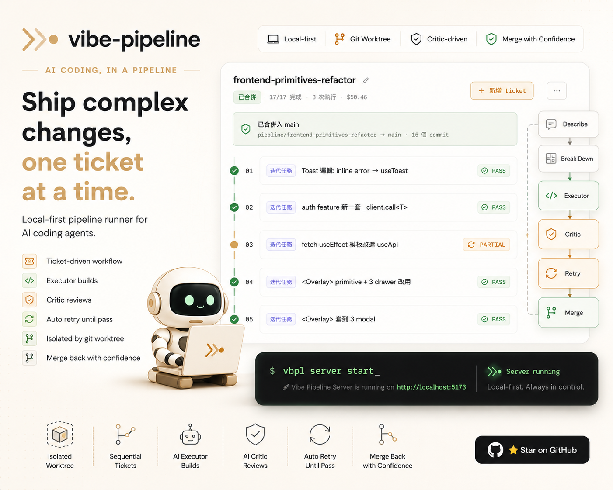
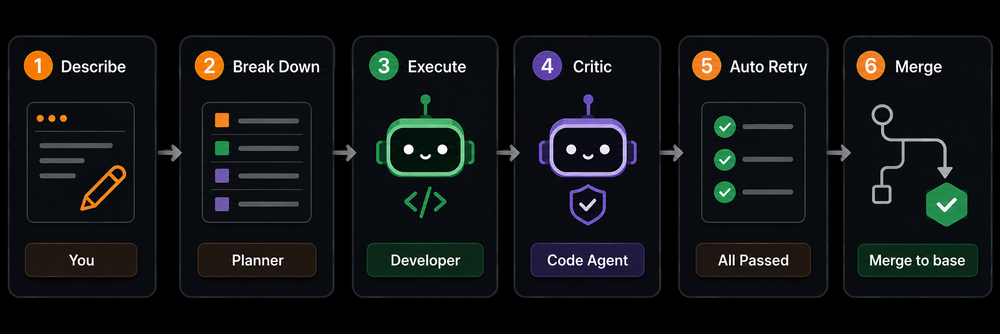
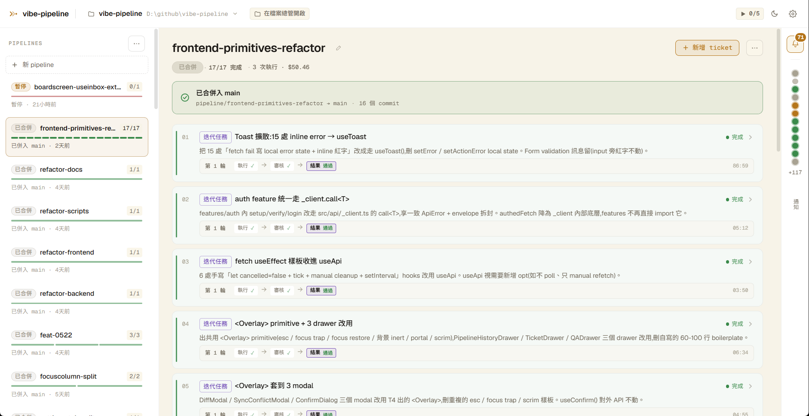
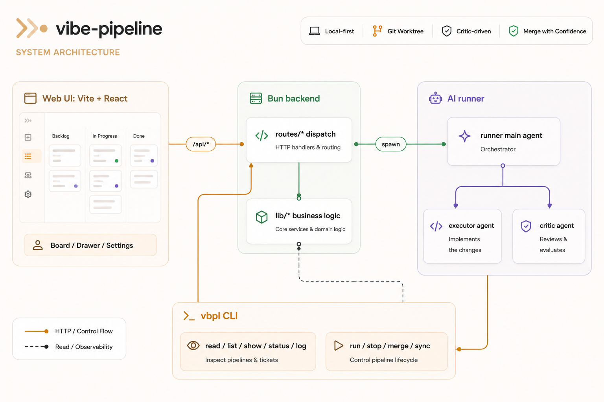

# vibe-pipeline



**vibe-pipeline 是給 AI coding agent 用的 local-first pipeline runner。**把工作拆成有順序的 ticket,每張 ticket 先由 executor 實作、再由 critic 審核;每條 pipeline 跑在獨立 git branch / worktree,審核循環通過後才 merge 回 base。

[](LICENSE)
[](https://bun.sh)
[](https://react.dev)

## 為什麼需要它

AI coding 工具很適合處理單點任務,但長一點的改動仍然需要 scope、順序、隔離、審核、retry 和 merge 紀律。vibe-pipeline 把這些步驟包成一條可追蹤的工作流:

1. 在 Web UI 或 CLI 描述要做的工作。
2. scope 太大時,先拆成多張 ticket。
3. executor agent 依 ticket 實作。
4. critic agent 讀 diff,判定 PASS、FAIL 或 PARTIAL。
5. ticket 未通過時自動 retry,直到 PASS 或達 iter 上限。
6. pipeline 全部完成後 merge 回 base branch。



## 產品預覽



主介面是 board、drawer 和 settings。Backend 用單一 Bun process 同時 serve Web UI 與 API;`vbpl` CLI 則讓 agent 和 script 透過終端機操作同一份狀態。

## 安裝

需要 [Bun](https://bun.sh) 1.1 以上與 Git。

### macOS / Linux

```sh
curl -fsSL https://raw.githubusercontent.com/sugarfun-it/vibe-pipeline/main/scripts/install.sh | sh
```

### Windows PowerShell

```powershell
irm https://raw.githubusercontent.com/sugarfun-it/vibe-pipeline/main/scripts/install.ps1 | iex
```

Installer 會下載最新 release、建立 `vbpl` shim、可選擇加入 PATH,並啟動 backend 到 `http://localhost:3001`。

## 快速開始

```bash
vbpl server start
vbpl server status
```

開啟:

```text
http://127.0.0.1:3001/board
```

常用 CLI:

```bash
vbpl project init --here
vbpl project list
vbpl pipeline list --project <hash>
vbpl pipeline run <id>
vbpl pipeline status <id>
vbpl pipeline log <id>
vbpl ticket list --pipeline <id>
vbpl pipeline sync <id>
vbpl pipeline merge <id>
```

所有指令都支援 `--json`,方便 script 和 agent automation 使用。

## 核心概念

| 概念 | 說明 |
|---|---|
| Project | 註冊到 vibe-pipeline 的 git repository |
| Ticket | 一個有 goal、prompt、acceptance、mode、status 的工作單位 |
| Pipeline | 有順序的 ticket 列表,跑在自己的 branch 和 worktree |
| Executor | 負責改 code 的 agent 角色 |
| Critic | 負責讀 diff 並回傳 PASS、FAIL 或 PARTIAL 的 agent 角色 |
| Iter mode | Executor 和 critic 反覆循環,直到 PASS 或達 iter 上限 |
| Merge | 完成的 pipeline branch 合併回 base branch |

## 功能

- Web board 管理 project、pipeline、ticket、QA 和 settings
- `vbpl` CLI 支援 terminal 與 agent-driven 操作
- 每條 pipeline 使用獨立 git branch / worktree 隔離
- Executor / critic 可分別設定 provider、model、reasoning effort
- Ticket-level iterative review loop
- 自動 merge,先走 git 原生 merge,有衝突才交給 AI
- 可把 base branch 同步進 pipeline worktree
- Backend 重啟後自動恢復 stale running 狀態
- PWA + Tailscale 遠端存取
- 可使用 hosted gateway 或自架 gateway 推送通知

## 架構



CLI 的 read path 會重用 backend lib;run、stop、merge、sync 這類會 spawn / kill 子程序的操作則走 backend API,避免長時間執行的 child process 變成孤兒。

## AI Agent 設定

可重複安裝的 AI skill bundle 在:

```text
docs/vibe-pipeline/
```

把整個資料夾放進你的 AI tool skills path:

| 工具 | 目的地 |
|---|---|
| Claude Code | `~/.claude/skills/vibe-pipeline/` |
| Codex | `~/.codex/skills/vibe-pipeline/` |

安裝後開新 AI session,問它可以怎麼使用 `vbpl`。

## Maintainer 開發

```bash
bun install
bun run start
```

常用 script:

| 指令 | 用途 |
|---|---|
| `bun run start` | build frontend,再啟動 3001 backend |
| `bun run server` | 只啟動 backend,不開 watch mode |
| `bun run server:e2e` | 啟動隔離測試 backend on 3101 |
| `bun run build` | typecheck + build |
| `bun run lint` | 跑 Biome lint |
| `bun run test:e2e` | 跑 Playwright e2e tests |

## 遠端存取

vibe-pipeline 沒有 app-level auth。手機或遠端存取請只暴露在自己的 Tailscale tailnet 內:

```bash
tailscale serve --https=443 http://localhost:3001
```

接著用手機開 Tailscale HTTPS URL,安裝成 PWA。

## 文件

- [主 AI skill](docs/vibe-pipeline/SKILL.md)
- [安裝細節](docs/vibe-pipeline/install.md)
- [Changelog / 設計決策](docs/CHANGELOG.md)
- [Repo 結構](docs/refs/repo-structure.md)
- [Maintainer guide](CLAUDE.md)

## License

MIT,見 [LICENSE](LICENSE)。
