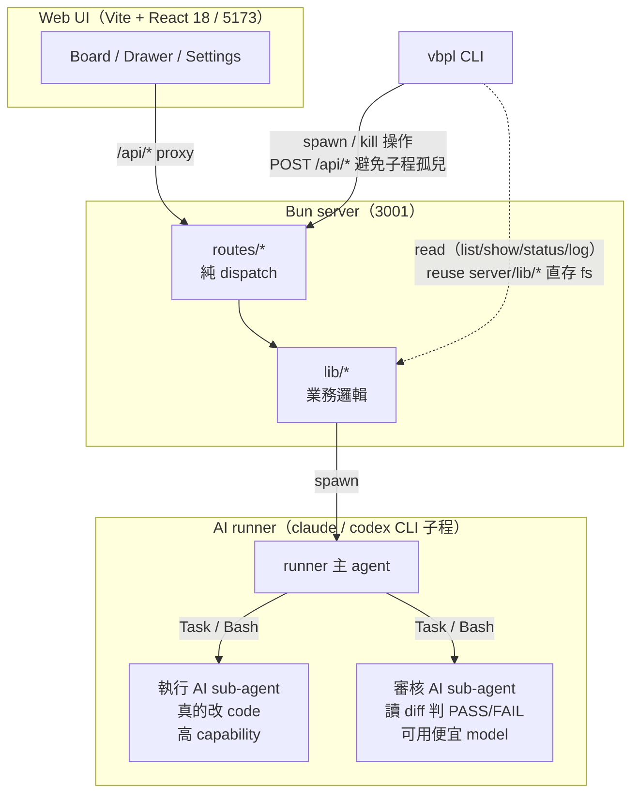

# vibe-pipeline

多 AI agent(執行 + 審核)的 ticket / pipeline 編排器。每張 ticket 由 **執行 AI** 跑、**審核 AI** 審,迭代模式自動迴圈到審核 pass。Pipeline 是有序 ticket 列表,跑在獨立 git branch 上,完成後 merge 回 base。

平常用 Web UI,終端機則有 `vbpl` CLI。兩邊共用同一套 backend lib,沒有 HTTP-only 路徑。

---

## 給 AI:第一次接觸本 repo

User 把 repo URL 給你的話,標準流程:

1. **看本 README 全文** — 了解產品 + 找到主 SKILL 位置
2. **建議 user 裝主 SKILL** — `docs/vibe-pipeline/SKILL.md` 是本檔最重要的引導手冊;source dir(`docs/vibe-pipeline/`)直接 cp 進 AI 的 skills 路徑(Claude Code → `~/.claude/skills/vibe-pipeline/`,codex → `~/.codex/skills/vibe-pipeline/`,其他平台看各自 docs)。詳細路徑跟複製指令在 §給 AI 安裝
3. **(user 開新 session,你接收主 SKILL)** — 主 SKILL 是跨 project 永久載入的 AI 操作手冊
4. **檢查 vbpl 裝了沒** — 跑 `vbpl --version`;沒裝 → 看 [`docs/vibe-pipeline/install.md`](docs/vibe-pipeline/install.md) 跑 per-OS build + PATH 步驟
5. **進入正常操作** — 看主 SKILL「標準操作流」段

如果 user 的 AI 不認 Claude SKILL 格式:看 `AGENTS.md`(跨 provider pointer)。

本 README 是人類 + first-touch AI 共用 quick guide;主 SKILL 是長駐 AI 操作手冊。

---

## 安裝 (enduser)

一行裝完(需先有 [Bun](https://bun.sh) ≥ 1.1 + Git):

**macOS / Linux**

```sh
curl -fsSL https://raw.githubusercontent.com/eric14304/vibe-pipeline/main/scripts/install.sh | sh
```

**Windows PowerShell**

```powershell
irm https://raw.githubusercontent.com/eric14304/vibe-pipeline/main/scripts/install.ps1 | iex
```

script 會抓 latest release tarball → 解到 `~/.vibe-pipeline/app/` → 建 `vbpl` shim → 問要不要加 PATH → 自動 `vbpl server start`(backend on `http://localhost:3001`)。

拔掉:

```sh
# macOS / Linux
curl -fsSL https://raw.githubusercontent.com/eric14304/vibe-pipeline/main/scripts/uninstall.sh | sh
```

```powershell
# Windows
irm https://raw.githubusercontent.com/eric14304/vibe-pipeline/main/scripts/uninstall.ps1 | iex
```

uninstall 只移除 `~/.vibe-pipeline/app/` 跟 shim;state / auth / worktrees 都保留,要全清自己 `rm -rf ~/.vibe-pipeline`。

Maintainer / 改 source code → 看下面 §快速開始 §Maintainer 段。

---

## 快速開始

需要 [Bun](https://bun.sh)(≥ 1.1)+ Git。

### Enduser / AI 操作(推薦)

先確定 `vbpl` 已安裝(PATH 內可跑 `vbpl --version`;安裝見 [`docs/vibe-pipeline/install.md`](docs/vibe-pipeline/install.md))。

```bash
vbpl server start
vbpl server status
```

`vbpl server start` 會自動找到 vibe-pipeline repo(從 cwd / `VBPL_HOME` / 已記錄的 server.json),背景啟動 backend,終端機關掉 backend 仍會活著。`vbpl pipeline run|stop|merge|sync` 也會自動確保本機 backend 已啟動。

### Maintainer 改 source code

```bash
bun install
bun run start         # build + 同時起 backend 3001 + preview 4173
# 開 http://127.0.0.1:4173/board
```

`start` 一條指令搞定 production build + 後端 + 前端 preview(PWA SW 註冊正常)。日常改 VP source code 用 `bun run dev`(走 5173 vite HMR,SW 不註冊)。

**Sub-agent 用 `sub:*` script + 100 port**(`sub:dev` / `sub:server` / `sub:preview`)避開 user backend。詳見 [package.json](package.json)。

打包 CLI 成單檔 binary:

```bash
bun run cli:build           # Windows x64
bun run cli:build:mac       # macOS arm64 (Apple Silicon)
bun run cli:build:mac-x64   # macOS x64 (Intel)
bun run cli:build:linux     # Linux x64
# → dist-cli/vbpl[.exe|-mac|-mac-x64|-linux]
```

---

## 給 AI 安裝(讓你家的 AI 學會用 vbpl)

主 SKILL bundle 在 [`docs/vibe-pipeline/`](docs/vibe-pipeline/)(含 `SKILL.md` + `install.md` + `repl-runner.md` 三個檔)。把**整個 dir** cp 進 AI 的 skills 路徑(Claude Code → `~/.claude/skills/vibe-pipeline/`;codex → `~/.codex/skills/vibe-pipeline/`;其他平台看各自 docs)。AI 自己會 cp,你叫它「裝這個 SKILL」就行。

只想對某個 repo 限定,cp 進 `<that-project>/.claude/skills/vibe-pipeline/`。

驗證:在新 session 開 AI,問「我能用 vbpl 幹嘛?」AI 應該秒回 pipeline / ticket / executor / critic 心智 + 常用指令。

> 註:repo 內 `.claude/skills/` 還有 `vibe-pipeline-frontend` / `-backend` / `-cli` / `-e2e` 四個 SKILL,**那些只給改 vibe-pipeline 本身 code 的 AI 用**,enduser 不需要安裝。

---

## 架構



每個 task class 各自挑 provider(claude / codex)+ model + reasoning effort,從 Settings 改或 `vbpl config set <key> <value>`:

| Task class | 用途 |
|---|---|
| `qa` | 跟 user 對話收斂 ticket 規格 |
| `split` | One-shot 判「這該拆 N 張」 |
| `runner` | Pipeline 主 agent(編排 ticket) |
| `executor` | 寫 / 改 code |
| `critic` | 讀 diff,PASS / FAIL / PARTIAL |
| `merge` | 衝突解 |

工廠預設見 `shared/types.ts:DEFAULT_USER_CONFIG`(新建 user 第一次起 server 時寫進 `~/.vibe-pipeline/config.json`)。看當前生效值跑 `vbpl config list`。

---

## 功能

- **Pipeline = 有序 ticket 列表**,跑在獨立 git branch,worktree 隔離在 `~/.vibe-pipeline/worktrees/<projHash>/<pipelineId>/`
- **QA drawer**:跟 AI 聊出 ticket 規格;AI 看到 scope 跨多件獨立工作會自動建議拆分
- **迭代模式**:執行 → 審核 → retry 迴圈到 PASS 或達 iter 上限
- **自動合併**(全 ticket done + `autoMerge=true`):後端先試純 `git merge --no-ff`,撞衝突才 spawn AI
- **同步**:把 base 拉進 pipeline worktree,同 git-first → 衝突才 AI 的二段式
- **跨 provider sub-agent**:claude main → Task tool;codex → Bash 直呼 `codex exec`
- **PWA + Tailscale + TOTP**:桌機跑 server,手機透過 Tailscale HTTPS 連入,非 loopback 強制 TOTP,FCM push ticket 事件到手機
- **CLI `vbpl`**:4 nouns(project / pipeline / ticket / config)+ `--json` mode;spawn 操作走 backend HTTP 避免子程孤兒
- **狀態恢復**:server 重啟時自動掃 pipeline 收斂 stale `running` → paused(legacy `stopping` 殘留也一併修);runtime watchdog 抓死 PID

---

## CLI

打包:
```bash
bun run cli:build           # Windows x64           → dist-cli/vbpl.exe
bun run cli:build:mac       # macOS arm64 (Apple)   → dist-cli/vbpl-mac
bun run cli:build:mac-x64   # macOS x64 (Intel)     → dist-cli/vbpl-mac-x64
bun run cli:build:linux     # Linux x64             → dist-cli/vbpl-linux
```

裝 PATH:`vbpl --version` 驗即可。**完整 install per-OS + trouble 看 [`docs/vibe-pipeline/install.md`](docs/vibe-pipeline/install.md)**。

### 常用指令

```bash
vbpl server start                                             # 背景啟動 backend
vbpl server status
vbpl server logs -f
vbpl server restart
vbpl server stop
vbpl project list
vbpl project init --here                                        # fresh 資料夾一鍵 init
vbpl pipeline list --project <hash>
vbpl pipeline status <id>
vbpl pipeline run <id>                                          # 啟動 runner(需要 backend)
vbpl pipeline log <id>                                          # 過往 run 摘要
vbpl ticket list --pipeline <id>                                # 列 ticket
vbpl ticket show --pipeline <id> --ticket <n>                   # 看單張 ticket 細節
vbpl ticket add --pipeline <id> --title "..." --mode iter
vbpl ticket update --pipeline <id> --ticket <n> --status done   # 改 title/goal/prompt/acceptance/mode/status/iter-limit
vbpl ticket remove --pipeline <id> --ticket <n>
vbpl config set runner.model claude-opus-4-7
vbpl pipeline sync <id>                                         # git merge base → worktree
vbpl pipeline sync <id> --ai                                    # 讓 AI 解衝突
vbpl pipeline merge <id>                                        # 合併回 base(先試 git,衝突才 AI)
```

每個 verb 都吃 `--json`,搭配 `jq` / PowerShell `ConvertFrom-Json` 寫 script 用。

---

## 遠端存取(Tailscale)

1. 桌機 + 手機都裝 Tailscale,登入同 tailnet
2. 桌機跑 `tailscale serve --https=443 http://localhost:4173`(走 preview port,SW 才註冊)
3. 手機開 `https://<machine>.<tailnet>.ts.net`,安裝成 PWA
4. 首次非 loopback 連線 → TOTP 設定(掃 QR 加進 Authenticator,之後每個 session 輸入 6 碼登入)
5. Settings →「通知」開啟推播,ticket 事件會到手機(需先填 push gateway,見下)

手機遠端踩雷(Windows ACL / HTTPS / 0.0.0.0 / ALLOWED_ORIGINS / 離線 push 補送)見 [`.claude/rules/remote-access.md`](.claude/rules/remote-access.md)。

---

## Push 通知 setup(零設定)

**開 PWA → Settings →「通知」啟用推播 → 即用**。enduser 不必開 Firebase、不必跟 maintainer 拿 token、不必填任何 `.env` push 變數。

第一次 Settings 開啟通知時,backend 會自動向 maintainer host 的 gateway(`https://vp-gateway-799841449136.asia-east1.run.app`)申請 token(IP rate-limit 5/day),拿到後存 `~/.vibe-pipeline/gateway-token`(0600),後續所有 push 自動帶這個 token。Firebase Web SDK config + gateway URL 已 hardcode 進 build,不必設。

要自架一份 gateway / fork 後指到自己 endpoint?設 `PUSH_GATEWAY_URL` / `PUSH_GATEWAY_TOKEN` env var 即可 override 內建預設(`VITE_FCM_*` 同理 override Firebase config)。完整自架說明見 [`gateway/README.md`](gateway/README.md) 跟 [`docs/refs/archive/fcm-push-gateway-2026-05-17.md`](docs/refs/archive/fcm-push-gateway-2026-05-17.md)。

Maintainer ops:Firebase project / service account key / Cloud Run 配置 / cost 監控($1/mo budget alert + Cloud Run max-instances=1 hard cap)/ abuse 管控(per-IP auto-issue rate limit + per-token send 日誌)。

---

## Repo 結構

```
src/         前端(Vite + React)
server/      Bun 後端(routes 純 dispatch,lib/ 純邏輯)
cli/         vbpl CLI(reuse server/lib/*)
shared/      跨前後端持久化型別
.claude/     repo maintainer SKILL(改 src/server/cli/tests 用)
docs/        SKILL(主)/ install.md / CHANGELOG.md / refs/ 設計文件
public/      靜態(PWA manifest、service worker、icons)
tests/e2e/   Playwright(mock CI 模式 + real 模式)
```

SKILL 文件分兩種,動非 trivial 改動前先讀:

**主 SKILL**(enduser-facing artifact,可裝進 AI 的 skills 路徑):
- [vibe-pipeline](docs/vibe-pipeline/SKILL.md) — 產品定位 / scope / vbpl 操作手冊

**maintainer SKILL**(`.claude/skills/`,只給改 vibe-pipeline 自己 code 的 AI 用):
- [vibe-pipeline-frontend](.claude/skills/vibe-pipeline-frontend/SKILL.md) — UI 慣例
- [vibe-pipeline-backend](.claude/skills/vibe-pipeline-backend/SKILL.md) — server / runner / sync
- [vibe-pipeline-cli](.claude/skills/vibe-pipeline-cli/SKILL.md) — CLI 慣例
- [vibe-pipeline-e2e](.claude/skills/vibe-pipeline-e2e/SKILL.md) — Playwright 覆蓋矩陣

---

## Scripts

| 指令 | 用途 |
|---|---|
| `vbpl server start` | **enduser / AI 推薦** — 背景啟動 backend(3001),終端機關掉不會殺 backend |
| `vbpl server status` | 檢查 backend health / PID / uptime |
| `vbpl server logs [-f]` | 看 backend log;`-f` 即時 tail |
| `vbpl server restart` | 重啟 backend(PID 會換新) |
| `vbpl server stop` | 停掉 `vbpl server start` 管理的 backend |
| `bun run start` | maintainer 驗 production bundle:build + backend 3001 + preview 4173 |
| `bun run dev` | maintainer 改 source:vite 5173 HMR + backend 3001(SW 不註冊) |
| `bun run server` | maintainer 只起 backend(3001;前景 process) |
| `bun run preview` | maintainer 只起 frontend preview(4173,需先 `bun run build`) |
| `bun run sub:dev` | sub-agent 用:vite 5273 + backend 3101(避開 user 的 3001/5173) |
| `bun run sub:server` | sub-agent 只 backend(3101) |
| `bun run sub:preview` | sub-agent preview(4273 + proxy → 3101) |
| `bun run build` | `tsc -b && vite build` → `dist/` |
| `bun run lint` | Biome lint |
| `bun run test:e2e` | Playwright mock 模式(CI 預設) |
| `bun run test:e2e:real` | Playwright real 模式(燒 token,opt-in) |
| `bun run vbpl <noun> <verb>` | CLI 開發模式(不用每次 rebuild) |
| `bun run cli:build` | 把 CLI 編成單檔 binary |
| `bun run icons` | 從 `public/icon.svg` 重產 PWA icons(需 ImageMagick) |

---

## License

目前未明確開放,以個人 / 協作使用為主。要釐清特定用途請開 issue。
